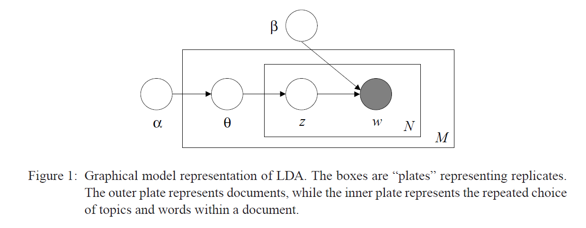
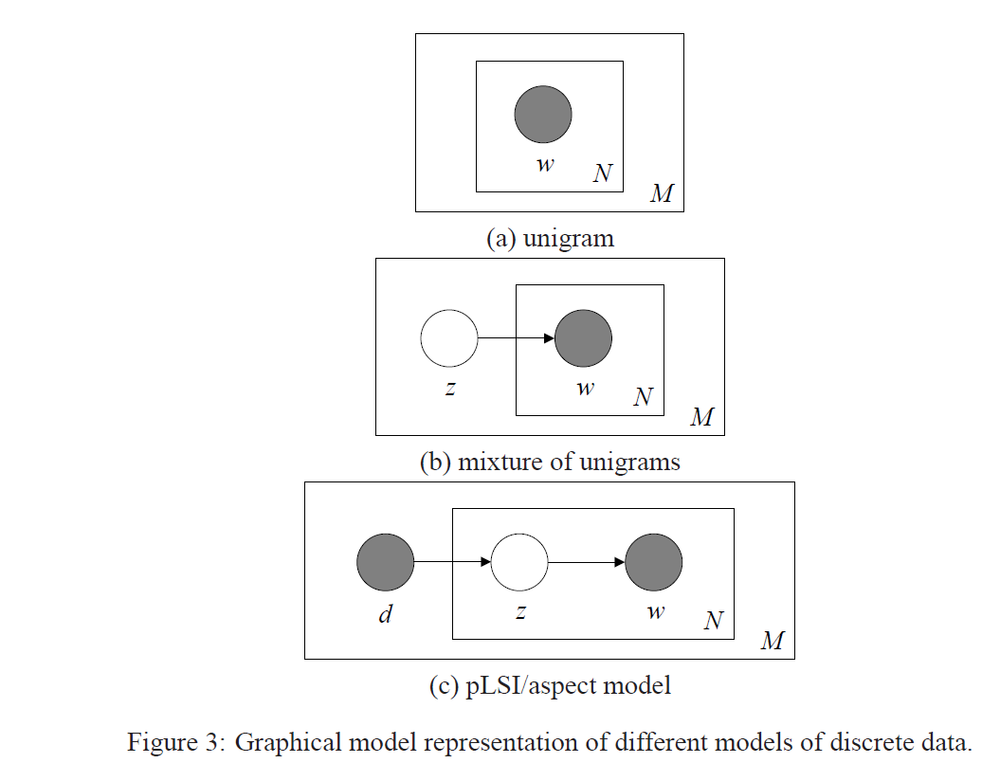
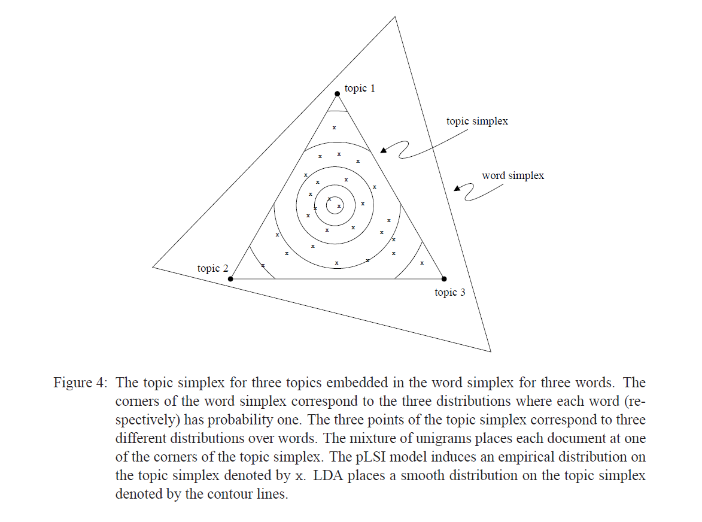

## Related Conceptions
1. [Gamma Function](/mathematics/Gamma Function)
2. [Beta Function](/mathematics/Beta Function)
3. [Dirichlet Distribution](/mathematics/Dirichlet Distribution)
4. [k-dimension Dirichlet Distribution](#)
5. [LSI/LSA (Latent Semantic Indexing/Analysis)](/ml/LSI and PLSI)
6. [PLSI/PLSA (Probabilistic LSI/LSA)](/ml/LSI and PLSI)
7. [Exchangeability](#)

## Description
LDA is a generative model.

## Usages
1. Topic Model
2. Collaborative Filtering
3. Content-basd Image Retrieval
4. Bioinformatics

## Assumptions
1. Choose \\(N \\sim Poisson(\\xi)\\)
2. Choose \\( \\theta \\sim Dir(\\alpha)\\)
3. For each of the N words \\(w_{n}\\):
    - Choose a topic \\(z_{n} \\sim Multinomial(\\theta)\\).
    - Choose a word \\(w_{n}\\) from \\(p(w_{n}\|z_{n}, \\beta) \\), a Multinomial probability conditioned on the topic \\(z_{n}\\).

## Graphic Model Representation

- Three levels of LDA representation
    - \\(\\alpha\\) and \\(\\beta\\) are corpus parameters, assumed to be sampled once in the process of generating a corpus.
    - \\(\\theta\_{d}\\) are document-level variables, sampled once per document.
    - \\(z_{dn}\\) and \\(w_{dn}\\) are word-level variables and are sampled once for each word in each document.

## Model
Given the parameter \\(\\alpha\\) and \\(\\beta\\), the joint distribution of a topic mixture \\(\\theta\\), a set of N topics z, and a set of N words w is given by:

\\[p(\\theta,z,w\|\\alpha,\\beta)=p(\\theta\|\\alpha) \\prod\_{n=1}^N p(z\_{n}\|\\theta)p(w\_{n}\|z\_{n},\\beta)\\]

Integrating over \\(\\theta\\) and summing over \\(z\\), we obtain the marginal distribution of a document:

\\[p(w\|\\alpha,\\beta)=\\int p(\\theta\|\\alpha)(\\prod\_{n=1}^N \\sum\_{z\_{dn}} p(z\_{dn}\|\\theta)p(w\_{dn}\|z\_{dn},\\beta)) (\\prod\_{n=1}^N\_{d}) {\\rm d}\\theta \\]

Taking the product of the marginal probability of single document, we obtain the probability of a corpus:

\\[p(D\|\\alpha,\\beta)=\\prod\_{d=1}^M \\int p(\\theta\_{d}\|\\alpha)  {\\rm d}\\theta\_{d} \\]

## Relation with other latent variable models
1. Unigram Model
Under the unigram model, the words of every document are drawn independently from a single multinomial distribution:
\\[p(w)=\\prod\_{n=1}^N p(w\_{n})\\]
2. Mixture of unigrams
Under the mixtrue model, each document is generated by first choosing one topic z and then generating N words independently from the conditional multinomial \\(p(w\|z)\\):
\\[p(w)=\\sum\_{z} p(z)\\prod\_{n=1}^N p(w\_{n}\|z)\\]
3. PLSI
The pLSI model attempts to relax the simplifying assumption made in the mixture of unigrams model that each document is generated from only one topic. In a sense, it does capture the possibility that a document may contain multiple topics since \\(p(z\|d)\\) serves as the mixture weights of the topics for a particular document d:
\\[p(d,w\_{n})=p(d)\\sum\_{z} p(w\_{n}\|z)p(z\|d)\\]
PLSI has following shortcomings:
- It can only model the documents in training set, which means \\(p(z\|d)\\) is only for documents trained. And it's not clear how to model new seen documents.
- For a k-topic PLSI model with vocabular size V and document count M, there exists \\(kV+kM\\) parameters and therefor linear growth in M. The linear growth of parameters suggests that the model is prone to overfitting.
4. Graphical Representations

5. A geometric interpretation (*extract from reference [1], the LDA paper*)
All four of the models described above—unigram, mixture of unigrams, pLSI, and LDA—operate in the space of distributions over words. Each such distribution can be viewed as a point on the (V −1)-simplex, which we call the word simplex.

The unigram model finds a single point on the word simplex and posits that all words in the corpus come from the corresponding distribution. The latent variable models consider k points on the word simplex and form a sub-simplex based on those points, which we call the topic simplex. Note that any point on the topic simplex is also a point on the word simplex. The different latent variable models use the topic simplex in different ways to generate a document.

1. The mixture of unigrams model posits that for each document, one of the k points on the word simplex (that is, one of the corners of the topic simplex) is chosen randomly and all the words of the document are drawn from the distribution corresponding to that point.
2. The pLSI model posits that each word of a training document comes from a randomly chosen topic. The topics are themselves drawn from a document-specific distribution over topics, i.e., a point on the topic simplex. There is one such distribution for each document; the set of training documents thus defines an empirical distribution on the topic simplex.
3. LDA posits that each word of both the observed and unseen documents is generated by a randomly chosen topic which is drawn from a distribution with a randomly chosen parameter. This parameter is sampled once per document from a smooth distribution on the topic simplex

## Posterior
Posterior distribution of the hidden variables given a document(Intractable):

\\[p(\\theta,z\|w,\\alpha,\\beta)=\\frac{p(\\theta,z,w\|\\alpha,\\beta)}{p(w\|\\alpha,\\beta)}\\]

Although the posterior distribution is intractable for exact inference, a wide variety of approximate inference algorithms can be considered for LDA, including Laplace approximation, variational approximation, and Markov chain Monte Carlo[See reference [1] for details].

## References
1. Blei, David M.; Ng, Andrew Y.; Jordan, Michael I (January 2003). Lafferty, John, ed. "Latent Dirichlet Allocation". Journal of Machine Learning Research. 3 (4–5): pp. 993–1022. doi:10.1162/jmlr.2003.3.4-5.993
